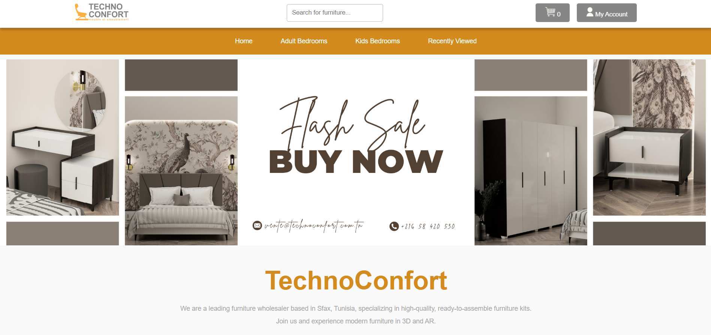

# 🪑 TechnoConfort website Portfolio Project

Welcome to the **TechnoConfort website**, a dynamic and interactive furniture website built as part of my ALX Software Engineering front-end portfolio project. This project redefines online wholesale furniture browsing by integrating **3D product visualization** and **Augmented Reality (AR)** experiences. Explore beautiful furniture collections (created and 3d modeled by me) like never before, interact with products in real-time, and test them virtually in your space!

---

## 🚀 Project Overview

This is a **solo project** designed to combine innovative technologies, responsive design, and modern UI/UX principles. 

**Key Features:**
- 🛋️ **Interactive 3D Models:** Rotate and explore furniture in real-time using model-viewer.
- 🌍 **Augmented Reality (AR) Support:** Scan QR codes to view furniture in AR.
- 🛒 **Functional Shopping Cart:** Add and manage products with a visual and interactive cart system.
- 🔐 **Login & Registration Pages:** Secure user authentication with hashed passwords stored in local storage.
- 📜 **Recently Viewed Products:** Track your browsing history and revisit previous products quickly.

---

## 🛠️ Architecture & Technologies Used

The project is structured with clean and modular code, making it easy to maintain and extend. Here’s a breakdown of the technologies used:

### **Frontend**
- **HTML5**: For creating a semantic and accessible structure.
- **CSS3**: Custom styling for responsive design and beautiful UI.
- **JavaScript (ES6)**: For dynamic functionality like 3D models, cart management, and local storage.
- **Model-Viewer API**: Used to render interactive 3D models with camera controls and auto-rotation.

### **Backend (Future Enhancements)**
- Firebase (planned): For user authentication and real-time database integration.

### **Development Tools**
- **VS Code**: As the primary development environment.
- **Git & GitHub**: For version control and collaboration.
- **Browser Developer Tools**: For debugging and optimization.

---

## 🆚 What Sets This Project Apart?

Unlike traditional furniture websites, this project brings the **showroom experience to your home**:
1. **Real-Time 3D Visualization**: Rotate and interact with furniture models to inspect them from every angle.
2. **AR Integration**: View furniture directly in your space using AR, helping you make better purchasing decisions.
3. **Dynamic Features**: A responsive cart, recent views tracker, and local storage functionality make this website intuitive and engaging.

---

## 🚧 Challenges & Areas for Improvement

### Challenges
- Styling the **3D model viewer** to fit seamlessly into all screen sizes.
- Managing **data persistence** and navigation between dynamic pages using local storage.
- Implementing **AR functionality** for every product and ensuring compatibility.
- Creating all the **3D models** of the Furniture Myself.

---

## 🔮 Next Steps

1. **Integrate Firebase**:
   - Use Firebase for login/registration to enable real-time authentication and better security.
   - Store product and cart data in a centralized database for multi-device support.

2. **Styling & UX Enhancements**:
   - Refine CSS for consistent and polished styling across all pages.
   - Add animations and transitions to improve user engagement.

3. **Improve AR Experience**:
   - Support AR for all devices, including iOS.

4. **Add Advanced Features**:
   - Wishlist functionality.
   - Product reviews and ratings.
   - Search and filtering options.

---

## 🖥️ How to Run the Project Locally

  - git clone https://github.com/Zaineb-Hammouda/TechnoConfort-website-Portfolio-Project.git

  - cd TechnoConfort-website-Portfolio-Project/

  - python3 -m http.server 8000

  Go to ur browser (preferrably chrome), type in: **localhost:8000** and enjoy browsing ^^

  (if you want to skip making an account and registering or if there's a bug, type in **localhost:8000/user_home.html** instead, in your browser)

## 🤝 Connect with Me
[Twitter](https://x.com/Zee_Hammouda)

[Linkedin]([https://x.com/Zee_Hammouda](https://www.linkedin.com/in/zainebhammouda/))

Thank you for visiting my project! Your feedback and suggestions are always welcome. 🙌
  
